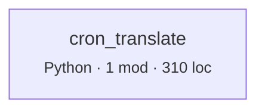

# Architecture map

Derived from source by automap 2.0. Every line is computed, not written. Regenerate with `automap map`; do not edit by hand.

## What this says about the system

Each item fired because a measurement crossed a threshold. The numbers and the evidence are from your code; the explanation is fixed text from a rule catalog, identical every time that rule fires on any repository. `automap rules` prints the catalog on its own so you can audit the claims before trusting them here. What none of it can tell you is why your team built it this way — that is what `automap adr` leaves blank.

| | count |
|---|---:|
| Notes | 1 |

### Note · No layering declared, so layer checks are off.

**Why it matters.** Cycles and coupling are measurable without knowing your intent, but 'this dependency should not exist' is not. Declaring layers is how you tell the tool what the design is supposed to be, which turns a description into a check that can fail in CI.

**What usually causes it.** Most repositories never write the layering down; it lives in review comments and in whoever has been there longest.

**What to do.** Add a `layers` map to `.automap.json`, ordered top to bottom. Start with the layering you believe you have — the first run will tell you whether you have it.

<sub>`ARCH-NOLAYERS` · Evidence quality</sub>

## Inside the files

The section above reasons about the import graph, where an edge either exists or does not. This one reads inside files, and its evidence is weaker by construction. Python is analysed with its real grammar, so complexity, nesting, length and parameter counts are exact. Every other language is matched lexically against comment-stripped source: those rules report **the presence of a construct, not a proven defect**. There is no dataflow analysis here. A flagged line may be perfectly correct in context, and an unflagged file may still be wrong. Read these as places to look, not as a verdict.

| category | findings |
|---|---:|
| Readability | 1 |

### Readability

**Worth attention · RDB-NESTING** — 1 of 15 Python functions (7%) nest control flow 4 levels or deeper.

*Why it matters.* Each level of nesting is a condition the reader must keep true in their head for everything inside it. Depth compounds: at four levels the reader is tracking four simultaneous invariants to understand one line. Nesting correlates with defects more strongly than length does.

*What usually causes it.* Conditions added around existing code rather than in front of it, because wrapping is a smaller diff than restructuring.

*What to do.* Invert the conditions and return early, so the exceptional cases leave at the top and the main path stays at one level. Extracting the innermost block into its own function achieves the same and gives the block a name.

<details><summary>Evidence</summary>

- `cron_translate.py:65` — `_field_phrase`, depth 4

</details>

---

The rest of this document is the evidence those findings were computed from.

## Coverage

What was read, and where every import went. Third-party means the target is expected to live outside this tree. Unaccounted means an import that looks local and resolved to nothing: those are edges missing from the graph below, usually a source root or path alias this tool has not been told about.

| Language | Fidelity | Files | Imports | Internal | Third-party | Unaccounted |
|---|---|---:|---:|---:|---:|---:|
| Python | parsed | 1 | 9 | 0 | 9 | 0 |

## Shape

- 1 modules across 1 components
- 0 internal import edges, 0 component couplings
- 310 lines
- propagation cost 0% — the share of other components an average component can reach through import paths

## Component graph



Dashed edges came from heuristic scanners. Thick borders are in a cycle. Labels count import sites.

## Ways in, and where they lead

No routes, commands, jobs, or navigation links were recognised. Either this tree has no entry points of its own, or its framework is not one this tool knows how to read.

## The nouns

No type declarations found.

## Reachability from entry points

What each root actually pulls in, to a depth of three. Nothing imports these modules, so they are where a reader has to start.

**cron_translate.py**

```
cron_translate  (Python)
```

## Coupling

| Component | Languages | Modules | LOC | Fan-in | Fan-out | Instability |
|---|---|---:|---:|---:|---:|---:|
| `cron_translate` | Python | 1 | 310 | 0 | 0 | 0.0 |

Instability is fan-out / (fan-in + fan-out). A component many things depend on that itself depends widely propagates change in both directions.

## Cycles

None at component level.

## External dependencies

Third-party packages. Standard-library imports are counted separately below, because a dependency you cannot remove is not a design decision.

| Package | Sites | Components | First site |
|---|---:|---:|---|
| `croniter` | 1 | 1 | cron_translate.py:17 |

7 standard-library modules imported; most used: `datetime` (2), `argparse` (1), `json` (1), `logging` (1), `re` (1), `sys` (1), `zoneinfo` (1).

## Churn against size

Most-changed files in the last 12 months. This is where any map you carry in your head goes stale first.

| File | Lines touched | LOC | Language |
|---|---:|---:|---|
| `cron_translate.py` | 662 | 310 | Python |

## Public surface

<details><summary><code>cron_translate</code> — 15 exported</summary>


`cron_translate`

- const DOW:26
- const DOW_NUMS:27
- const DST_SCAN_RUNS:39
- const EXIT_OK:23
- const EXIT_USAGE:24
- const LOGGER:19
- const MAX_DST_WARNINGS:40
- const MONTHS:44
- const _AT_TIME_RE:43
- const _INTERVAL_RE:42
- def describe:127
- def dst_warnings:198
- def main:266
- def phrase_to_cron:159
- def runs_between:186

</details>

---

**Not derivable from code.** Why these boundaries were chosen, what was rejected, and what constraint each one holds. `automap adr` scaffolds one file per decision point with the facts filled in and those questions blank.
